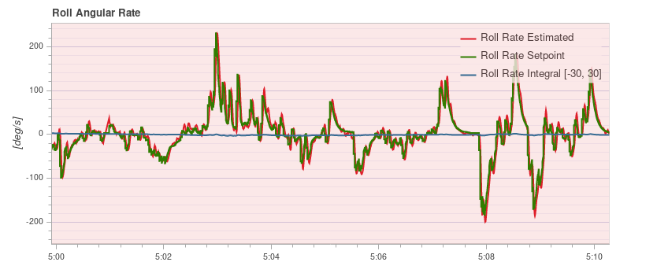
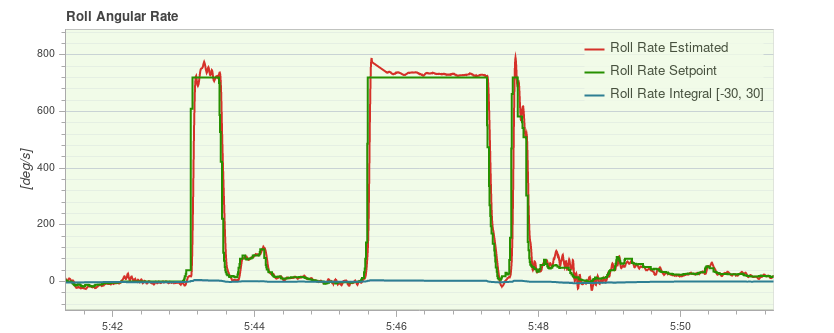

# Multicopter PID Tuning Guide

This tutorial explains how to tune the PID loops on PX4 for all [multicopter setups](../airframes/airframe_reference.md#copter) (Quads, Hexa, Octo etc).

Tuning is required when creating a new airframe type or modifying an existing supported frame. Generally if you're using a [supported specific configuration](../airframes/airframe_reference.md#copter) (e.g. using an airframe in [QGroundControl > Airframe](../config/airframe.md)), where all components are fixed, the default tuning should work.
To get the best performance it is usually good to tune a new vehicle, as for example using other ESCs or motors will require different tuning gains.

> **Warning** This guide is for advanced users. Un- or partially- tuned vehicles are likely to be unstable, and easy to crash.
> Make sure to have a Kill-switch assigned.

## Introduction 

PX4 uses **P**roportional, **I**ntegral, **D**erivative (PID) controllers, which are the most widespread control technique. 

The controllers are layered, which means a higher-level controller passes its
results to a lower-level controller. The lowest-level controller is the the **rate
controller**, then there is the **attitude contoller**, and then the **velocity
& position controller**.
The PID tuning needs to be done in the same order, starting with the rate
controller, as it will affect all other controllers.

## Preconditions

- You have selected the closest matching [default airframe configuration](../config/airframe.md) for your vehicle. This should give you a vehicle that already flies.
- You should have done an [ESC calibration](esc_calibration.md).
- [PWM_MIN](../advanced_config/parameter_reference.md#PWM_MIN) is set correctly. It needs to be set low, but such that the **motors never stop** when the vehicle is armed.

  This can be tested in [Acro mode](../flight_modes/acro_mc.md) or in [Manual/Stabilized mode](../flight_modes/manual_stabilized_mc.md):
  - Remove propellers
  - Arm the vehicle and lower the throttle to the minimum
  - Tilt the vehicle to all directions, about 60 degrees
  - Check that no motors turn off
- Optionally enable the high-rate logging profile with the [SDLOG_PROFILE](../advanced_config/parameter_reference.md#SDLOG_PROFILE) parameter so you can use the log to evaluate the rate and attitude tracking performance (the option can be disabled afterwards).

> **Warning** Always disable [MC_AIRMODE](../advanced_config/parameter_reference.md#MC_AIRMODE) when tuning a vehicle. 

## Tuning Steps

> **Note** For safety reasons, the default gains are set to low values.  
> You must increase the gains before you can expect good control responses. 

Here are some general points to follow when tuning:
- All gains should be increased very slowly as large gains may cause dangerous oscillations! 
  Typically increase gains by 20-30% per iteration, reducing to 5-10% for final fine tuning.
- Land before changing a parameter. Slowly increase the throttle and check for oscillations.
- Tune the vehicle around the hovering thrust point, and use the [thrust curve parameter or TPA](#thrust_curve) to account for thrust non-linearities or high-thrust oscillations.

### Rate Controller

The rate controller is the inner-most loop with three independent PID controllers to control the body rates:

- Roll rate control ([MC_ROLLRATE_P](../advanced_config/parameter_reference.md#MC_ROLLRATE_P), [MC_ROLLRATE_I](../advanced_config/parameter_reference.md#MC_ROLLRATE_I), [MC_ROLLRATE_D](../advanced_config/parameter_reference.md#MC_ROLLRATE_D))
- Pitch rate control ([MC_PITCHRATE_P](../advanced_config/parameter_reference.md#MC_PITCHRATE_P), [MC_PITCHRATE_I](../advanced_config/parameter_reference.md#MC_PITCHRATE_I), [MC_PITCHRATE_D](../advanced_config/parameter_reference.md#MC_PITCHRATE_D))
- Yaw rate control ([MC_YAWRATE_P](../advanced_config/parameter_reference.md#MC_YAWRATE_P), [MC_YAWRATE_I](../advanced_config/parameter_reference.md#MC_YAWRATE_I), [MC_YAWRATE_D](../advanced_config/parameter_reference.md#MC_YAWRATE_D))

A well-tuned rate controller is very important as it affects all flight modes.
The difference between a badly and a well tuned rate controller is, for example, easily noticeable in [Position mode](../flight_modes/position_mc.md).

The rate controller can be tuned in [Acro mode](../flight_modes/acro_mc.md) or [Manual/Stabilized mode](../flight_modes/manual_stabilized_mc.md):
- *Acro mode* is preferred, but is harder to fly. If you choose this mode, disable all stick expo:
  - `MC_ACRO_EXPO` = 0, `MC_ACRO_EXPO_Y` = 0, `MC_ACRO_SUPEXPO` = 0, 
    `MC_ACRO_SUPEXPOY` = 0
  - `MC_ACRO_P_MAX` = 200, `MC_ACRO_R_MAX` = 200
  - `MC_ACRO_Y_MAX` = 100
- *Manual/Stabilized mode* is simpler to fly, but it is also more difficult to see if the attitude or the rate controller needs more tuning.

In case your vehicle does not fly at all:
- If you notice strong oscillations when first trying to takeoff (to the point where it does not fly), 
  decrease all **P** and **D** gains until it takes off.
- If on the other hand you hardly get any reaction at all to your RC commands, increase the **P** gains.

The actual tuning is roughly the same in *Manual mode* or *Acro mode*:
You iteratively tune the **P** and **D** gains for roll and pitch, and then the **I** gain.
Initially you can use the same values for roll and pitch, and once you have good values, 
you can fine-tune them by looking at roll and pitch response separately (if your vehicle is symmetric, this is not needed).
For yaw it is very similar, except that **D** can be left at 0.

#### P Gain

The **P** (proportional) gain is used to minimize the tracking error. 
It is responsible for a quick response and thus should be set as high as possible, but without introducing oscillations.
- If the **P** gain is too high: you will see high-frequency oscillations.
- If the **P** gain is too low: 
  - the vehicle will react slowly to input changes. 
  - In *Acro mode* the vehicle will drift, and you will constantly need to correct to keep it level.

#### D Gain

The **D** (derivative) gain is used for dampening. It is required but should be set only as high as needed to avoid overshoots.
- If the **D** gain is too high: the motors become twitchy (and maybe hot), because the **D** term amplifies noise.
- If the **D** gain is too low: you see overshoots after a step-input.

#### I Gain

The **I** (integral) gain keeps a memory of the error. The **I** term increases when the desired rate is not reached over some time. 
It is important (especially when flying *Acro mode*), but it should not be set too high.
- If the I gain is too high: you will see slow oscillations.
- If the I gain is too low: this is best tested in *Acro mode*, by tilting the vehicle to one side about 45 degrees, 
  and keeping it like that. It should keep the same angle. 
  If it drifts back, increase the **I** gain. 
  A low **I** gain is also visible in a log, when there is an offset between the desired and the actual rate over a longer time.

Typical values are between 0.3 and 0.5, and the pitch gain usually needs to be a bit higher.

#### Testing Procedure

To test the current gains, provide a fast **step-input** when hovering and observe how the vehicle reacts. 
It should immediately follow the command, and neither oscillate, nor overshoot (it feels 'locked-in').

You can create a step-input for example for roll, by quickly pushing the roll stick to one side, 
and then let it go back quickly (be aware that the stick will oscillate too if you just let go of it, because it is spring-loaded — a well-tuned vehicle will follow these oscillations).

> **Note** A well-tuned vehicle in *Acro mode* will not tilt randomly towards one side,
> but keeps the attitude for tens of seconds even without any corrections.

#### Logs

Looking at a log helps to evaluate tracking performance as well. 
Here is an example for good roll and yaw rate tracking:

And here is a good example for the roll rate tracking with several flips, which create an extreme step-input. 
You can see that the vehicle overshoots only by a very small amount:

### Attitude Controller

This controls the orientation and outputs desired body rates with the following tuning parameters:
- Roll control ([MC_ROLL_P](../advanced_config/parameter_reference.md#MC_ROLL_P))
- Pitch control ([MC_PITCH_P](../advanced_config/parameter_reference.md#MC_PITCH_P)
- Yaw control ([MC_YAW_P](../advanced_config/parameter_reference.md#MC_YAW_P))

The attitude controller is much easier to tune. 
In fact, most of the time the defaults do not need to be changed at all.

To tune the attitude controller, fly in *Manual/Stabilized mode* and increase the **P** gains gradually. 
If you start to see oscillations or overshoots, the gains are too high.

The following parameters can also be adjusted. These determine the maximum rotation rates around all three axes:
- Maximum roll rate ([MC_ROLLRATE_MAX](../advanced_config/parameter_reference.md#MC_ROLLRATE_MAX))
- Maximum pitch rate ([MC_PITCHRATE_MAX](../advanced_config/parameter_reference.md#MC_PITCHRATE_MAX)
- Maximum yaw rate ([MC_YAWRATE_MAX](../advanced_config/parameter_reference.md#MC_YAWRATE_MAX))

### Thrust Curve / Throttle PID Attenuation (TPA) {#thrust_curve}

The tuning above optimises performance around the hover throttle. 
But it can be that you start to see oscillations when going towards full throttle.

There are two ways to counteract that:
- Adjust the **thrust curve** with the [THR_MDL_FAC](../advanced_config/parameter_reference.md#THR_MDL_FAC) parameter (preferred method).
  The thrust to PWM mapping is linear by default — setting `THR_MDL_FAC` to 1 makes it quadratic. 
  Values in between use a linear interpolation of the two.
  Typical values are between 0.3 and 0.5.
  You can start off with 0.3 and then increase it by 0.1 at a time. 
  If it is too high, you will start to notice oscillations at lower throttle values. 
  
  > **Note** The rate controller must be re-tuned if you change this parameter.
- Enable **Throttle PID Attenuation** (TPA), which is used to linearly reduce the
  PID gains when the throttle is
  above a threshold (breakpoint,
  `MC_TPA_BREAK_*` parameters). 
  The attenuation rate is controlled via
  `MC_TPA_RATE_*` parameters. TPA should generally not be needed, but it can be
  used in addition to the thrust curve parameter. The following illustration
  shows the thrust in relationship to the attenuated PID values:

  
<!-- The drawing is on draw.io: https://drive.google.com/file/d/1N0qjbiJX6JuEk2I1-xFvigLEPKJRIjBP/view?usp=sharing
     On the second Tab
-->

<!-- TODO: needed?
#### Feed Forward Tuning

Parameters: [MC_YAW_FF](../advanced_config/parameter_reference.md#MC_YAW_FF).

This parameter is not critical and can be tuned in flight, in worst case
yaw response will be sluggish or too fast. Play with FF parameter to get
comfortable response. Valid range is 0…1. Typical value is 0.8…0.9. (For
aerial video optimal value may be much smaller to get smooth response.)

Look at `ATTITUDE.yaw` in *QGroundControl*. Yaw overshoot should be not more
than 2-5% (which is less than the overshoot for roll and pitch angles).
-->

<!-- TODO
### Velocity & Position Controller
The PID-Gains should be chosen such that tracking is as tight as possible. Before doing any position/velocity control related tuning,
turn off all [higher-level position controller tuning gains](advanced_mc_position_tuning.md).

- [MPC_ACC_HOR_MAX](parameter_reference.md#MPC_ACC_HOR_MAX): 1000
- [MPC_ACC_HOR](parameter_reference.md#MPC_ACC_HOR) : 1000
- [MPC_DEC_HOR_SLOW](parameter_reference.md#MPC_DEC_HOR_SLOW) : 1000 
- [MPC_ACC_UP_MAX](parameter_reference.md#MPC_ACC_UP_MAX) : 1000 
- [MPC_ACC_DOWN_MAX](parameter_reference.md#MPC_ACC_DOWN_MAX) : 1000 
- [MPC_JERK_MAX](parameter_reference.md#MPC_JERK_MAX) : 0 
- [MPC_JERK_MIN](parameter_reference.md#MPC_JERK_MIN) : 1
 -->

### Airmode & Mixer Saturation {#airmode}

The rate controller outputs torque commands for all three axis (roll, pitch and yaw) and a scalar thrust value, which need to be converted into individual motor thrust commands. 
This step is called mixing.

It can happen that one of the motor commands becomes negative, for example for a low thrust and large roll command (and similarly it can go above 100%). 
This is a mixer saturation. 
It is physically impossible for the vehicle to execute these commands (except for reversible motors). PX4 has two modes to resolve this:
- Either by reducing the commanded torque for roll such that none of the motor commands is
  below zero (Airmode disabled). In the extreme case where the commanded thrust
  is zero, it means that no attitude correction is possible anymore, which is
  why a minimum thrust is always required for this mode.
- Or by increasing (boosting) the commanded thrust, such that none of the motor
  commands is negative (Airmode enabled). This has the big advantage that the
  attitude/rates can be tracked correctly even at low or zero throttle. It
  generally improves the flight performance.

  However it increases the total thrust which can lead to situations where the
  vehicle continues to ascend even though the throttle is reduced to zero. For a
  well-tuned, correctly functioning vehicle it is not the case, but for example
  it can happen when the vehicle strongly oscillates due to too high P tuning
  gains.

Both modes are shown below with a 2D illustration for two motors and a torque
command for roll r. On the left motor
r is added to the commanded thrust, while on
the right motor it is substracted from it.
The motor thrusts are in green.
With Airmode enabled, the commanded thrust is increased by
b. When it is disabled,
r is reduced.

  
<!-- The drawing is on draw.io: https://drive.google.com/file/d/1N0qjbiJX6JuEk2I1-xFvigLEPKJRIjBP/view?usp=sharing
     On the first Tab
-->

If mixing becomes saturated towards the upper bound, the Airmode logic is always used (the commanded thrust is reduced).

Once your vehicle flies well you can enable Airmode via the [MC_AIRMODE](../advanced_config/parameter_reference.md#MC_AIRMODE) parameter.

