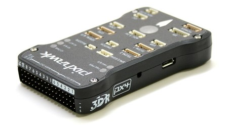
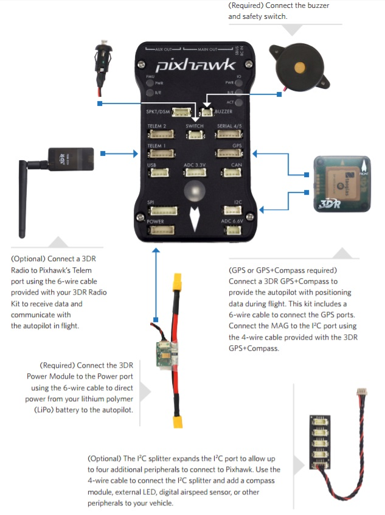
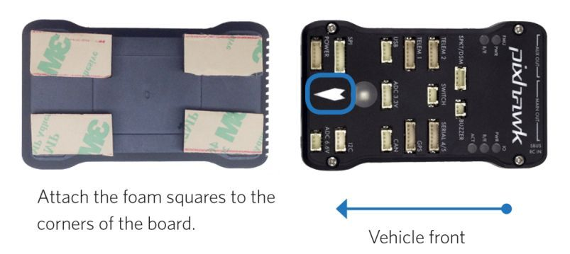
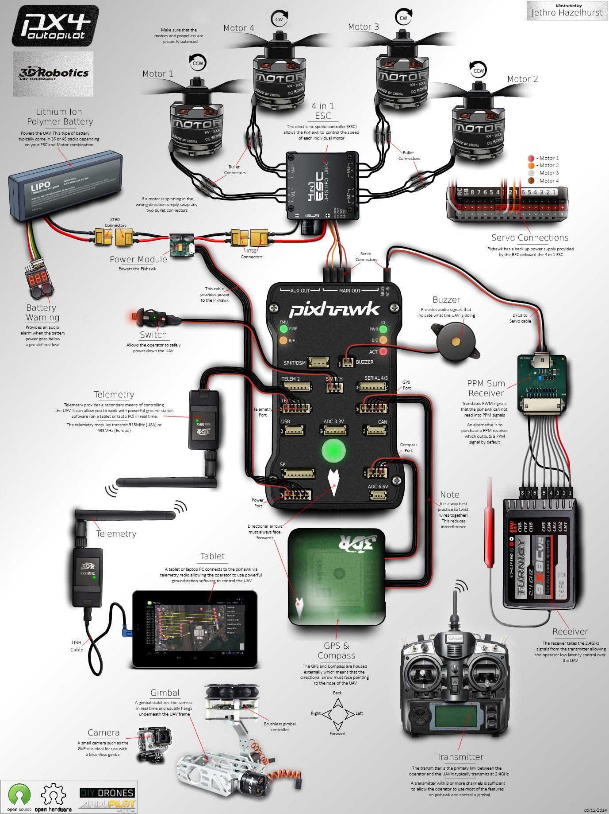

# Pixhawk Wiring Quick Start

This quick start guide shows how to power the *3DR Pixhawk* flight controller and connect its most important peripherals.
  
 

> **Note** The [3DR Pixhawk](https://dev.px4.io/hardware-pixhawk.html) is no longer available from 3DR. Other flight controllers based on the [Pixhawk FMUv2 architecture](../flight_controller/pixhawk_series.md) are available from other companies (these share the same connections, outputs, functions, etc. and are wired in a similar way).

## Wiring Chart Overview

The image below shows standard Pixhawk connections (excepting the motor and servo outputs). We'll go through each main part in the following sections.

 
> **Note** More detailed wiring information is [shown below](#detailed-wiring-infographic-copter).

## Mount and Orient Controller

The *Pixhawk* should be mounted on the frame using vibration-damping foam pads (included in the kit). It should be
positioned as close to your vehicle’s center of gravity as possible, oriented top-side up 
with the arrow points towards the front of the vehicle.

> **Note** If the controller cannot be mounted in the
  recommended/default orientation (e.g. due to space constraints) you will
  need to configure the autopilot software with the orientation that you
  actually used: [Flight Controller Orientation](../config/flight_controller_orientation.md).

## Buzzer and Safety Switch

Connect the included buzzer and safety switch as shown below (these are mandatory).

## GPS + Compass

Attach a GPS (required) to the GPS port using the 6-wire cable supplied in the kit. Optionally attach a compass to the I2C port using a 4-wire cable (the Pixhawk has an internal compass, which can be used if necessary).

> **Note** The diagram shows a combined GPS and Compass.  The GPS/Compass should be mounted on the frame as far away from other electronics as possible, with the direction marker towards the front of the vehicle (separating the compass from other electronics will reduce interference).

## Power

Connect the output of a *Power module* (PM) to the **POWER** port using a 6-wire cable as shown. The PM input will be connected to your LiPo battery, while the main output will supply vehicle ESCs/motors (possibly via a power distribution board).

The power module supplies the flight controller with power from the battery and also sends information about the analog current and voltage supplied via the module (including both power to the flight controller and to motors etc). 

> **Warning** The power module supplies the flight controller itself, but cannot power servos and other hardware connected to the controller's output ports (rail). For copter this does not matter because the motors are separately powered. 

For planes and VTOL the output rail will need to be separately powered in order to drive servos for rudders, elevons etc. Often the main pusher/puller motor uses an ESC with an integrated [BEC](https://en.wikipedia.org/wiki/Battery_eliminator_circuit) that can be connected to the Pixhawk output rail. If not, you will need to setup a 5V BEC to connect to one of the free Pixhawk ports (without power, the servos will not work).

<!-- It would be good to have real example of this powering --> 

## Radio Control

A remote control (RC) radio system is required if you want to *manually* control your vehicle (PX4 does not require a radio system for autonomous flight modes). 

You will need to [select a compatible transmitter/receiver](../getting_started/rc_transmitter_receiver.md) and then *bind* them so that they communicate (read the instructions that come with your specific transmitter/receiver). 

The instructions below show how to connect the different types of receivers to Pixhawk:

- PPM and S.BUS receivers must connect to the **RC** ground, power and signal pins as shown.
  
- PWM receivers must connect to the RCIN channel *via* a PPM encoder 
  [like this one](http://www.getfpv.com/radios/radio-accessories/holybro-ppm-encoder-module.html) (PPM receivers use a single signal wire for all channels, while PWM receivers have an individual wire for each channe).
- Spektrum and DSM receivers must connect to the **SPKT/DSM** input.
  

For more information about selecting a radio system, receiver compatibility, and binding your transmitter/receiver pair, see: [Remote Control Transmitters & Receivers](../getting_started/rc_transmitter_receiver.md).

## Telemetry Radios (Optional)

Telemetry radios may be used to communicate and control a vehicle in flight from a ground station (for example, you can direct the UAV to a particular position, or upload a new mission). One radio must be connected to your vehicle as shown below. The other is connected to your ground station computer or mobile device (usually by USB).

<!-- what configuration is required once you've set up a radio) -->

## Motors

The mappings between MAIN/AUX output ports and motor/servos for all supported air and ground frames are listed in the [Airframe Reference](../airframes/airframe_reference.md).

> **Caution** The mapping is not consistent across frames (e.g. you can't rely on the throttle being on the same output for all plane frames). Make sure to use the correct mapping for your vehicle.

> **Tip** If your frame is not listed in the reference then use a "generic" airframe of the correct type.

> **Note** The output rail must be separately powered, as discussed in the [Power](#power) section above.
  
<!-- INSERT image of the motor AUX/MAIN ports? -->

## Other Peripherals

The wiring and configuration of other components is covered within the topics for individual [peripherals](../peripherals/README.md).

## Configuration

General configuration information is covered in: [Autopilot Configuration](../config/README.md).

QuadPlane specific configuration is covered here: [QuadPlane VTOL Configuration](../config_vtol/vtol_quad_configuration.md)

<!-- what about config of other vtol types and plane. Do the instructions in these ones above apply for tailsitters etc? -->

## Detailed Wiring Infographic (Copter)

## Further information

- [Pixhawk Quick Start Guide (3DR)](https://3dr.com/wp-content/uploads/2017/03/pixhawk-manual-rev7-1.pdf)
- [Pixhawk Series](../flight_controller/pixhawk_series.md)
- [3DR Pixhawk](https://dev.px4.io/hardware-pixhawk.html) (PX4 DevGuide)
