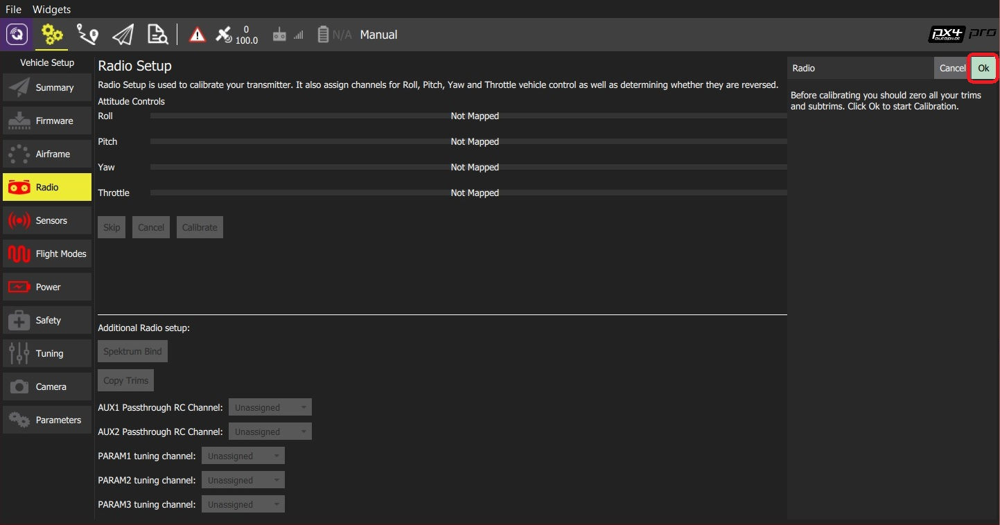
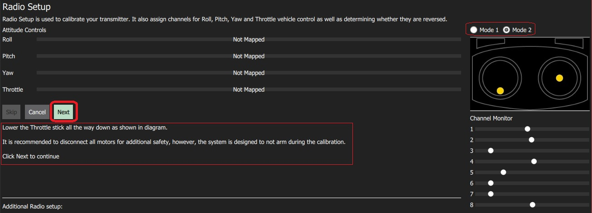

# Radio Setup

Radio Setup is used to configure the mapping of your main attitude control sticks (roll, pitch, yaw, throttle) to channels as well as calibrate the minimum, maximum, trim and reverse settings for all other transmitter controls/RC channels.

The calibration process is straightforward - you will be asked to move the sticks in a specific pattern that is shown on the transmitter diagram on the top right of the screen.

## Performing the Calibration 

To calibrate the radio:

1. Turn on your RC transmitter.
1. Start *QGroundControl* and connect the vehicle.
1. Select the **Gear** icon (Vehicle Setup) in the top toolbar and then **Radio** in the sidebar.
1. Press **OK** to start the calibration.
   
   
   
1. Set the [transmitter mode](../getting_started/rc_transmitter_receiver.md#transmitter_modes) radio button that matches your transmitter (this ensures that *QGroundControl* displays the correct stick positions for you to follow during calibration).

   

1. Move the sticks to the positions indicated in the text (and on the transmitter image). Press **Next** when the sticks are in position. Repeat for all positions.
1. When prompted, move all other switches and dials through their full range (you will be able to observe them moving on the *Channel Monitor*).
<!-- add info about additional radio setup here .... -->
<!-- 1. Select values for *Additional Radio Setup  -->
<!--    -->
1. Press **Next** to save the settings.
   

Radio calibration is demonstrated in the [autopilot setup video here](https://youtu.be/91VGmdSlbo4?t=4m30s) (youtube).

## Further Information

* [QGroundControl > Radio Control](https://docs.qgroundcontrol.com/en/SetupView/Radio.html)
* [PX4 Setup Video - @4m30s](https://youtu.be/91VGmdSlbo4?t=4m30s) (Youtube)
