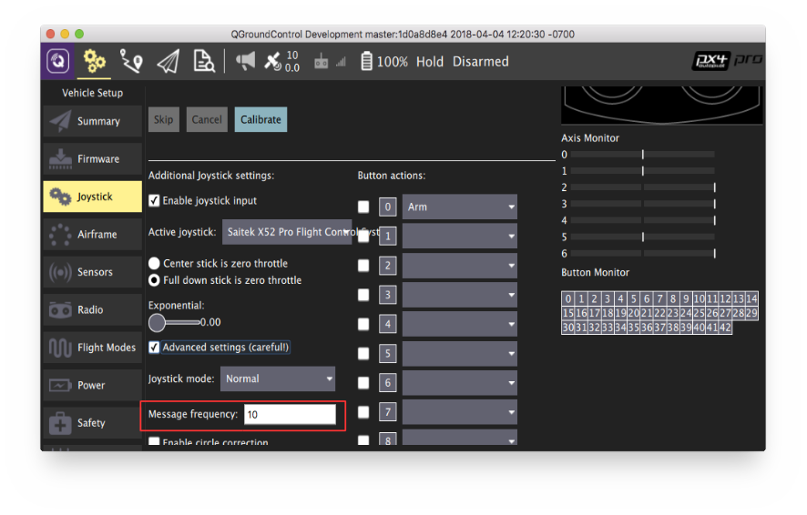

# Crazyflie 2.0

The Crazyflie line of micro quads was created by Bitcraze AB. An overview of the Crazyflie 2 (CF2) is here: https://www.bitcraze.io/crazyflie-2/

## Quick Summary

> **Note** The main hardware documentation is here: https://wiki.bitcraze.io/projects:crazyflie2:index

  * Main System-on-Chip: STM32F405RG
    * CPU: 168 MHz ARM Cortex M4 with single-precision FPU
    * RAM: 192 KB SRAM
  * nRF51822 radio and power management MCU
  * MPU9250 Accel / Gyro / Mag
  * LPS25H barometer
  
## Where to buy
* [Crazyflie 2.0](https://store.bitcraze.io/collections/kits/products/crazyflie-2-0)
* [Crazyradio PA 2.4 GHz USB dongle](https://store.bitcraze.io/collections/kits/products/crazyradio-pa): used for wireless communication between QGC and crazyflie 2.0.
* [Breakout deck](https://store.bitcraze.io/collections/decks/products/breakout-deck): breakout expansion board for connecting new peripherals. 
* [Flow deck](https://store.bitcraze.io/collections/decks/products/flow-deck): contains an optical flow sensor to measure movements of the ground and a distance sensor to measure the distance to the ground. This will be useful for precise altitude and position control.
* [SD-card deck](https://store.bitcraze.io/collections/decks/products/sd-card-deck): used for high speed onboard logging to a micro SD card.
* [Logitech Joystick](https://www.logitechg.com/en-ch/product/f310-gamepad)

## Flashing

After setting up the PX4 development environment, follow these steps to put the PX4 software on the CF2:

1. Grab source code of the PX4 [Bootloader](https://github.com/PX4/Bootloader)
1. Compile using `make crazyflie_bl`
1. Put the CrazyFly 2 (CF2) into DFU mode by following these steps:
   - Ensure it is initially unpowered
   - Hold down button
   - Plug into computer's USB port
   - After a second, the blue LED should start blinking and after 5 seconds should start blinking faster
   - Release button
1. Flash bootloader using dfu-util: `sudo dfu-util -d 0483:df11 -a 0 -s 0x08000000 -D ./build_crazyflie_bl/crazyflie_bl.bin` and unplug CF2 when done
   - If successful, then the yellow LED should blink when plugging in again
1. Grab the [Firmware](https://github.com/PX4/Firmware)
1. Compile with `make crazyflie_default upload`
1. When prompted to plug in device, plug in CF2: the yellow LED should start blinking indicating bootloader mode. Then the red LED should turn on indicating that the flashing process has started.
1. Wait for completion
1. Done! Calibrate via QGC

> **Note** If QGC does not connect with the vehicle, ensure that in [nuttx-config](https://github.com/PX4/Firmware/blob/master/platforms/nuttx/nuttx-configs/crazyflie/nsh/defconfig#L934) for crazyflie `# CONFIG_DEV_LOWCONSOLE is not set` is replaced by `CONFIG_DEV_LOWCONSOLE=y`

## Wireless

The onboard nRF module allows connecting to the board via Bluetooth or through the proprietary 2.4GHz Nordic ESB protocol.

- A [Crazyradio PA](https://www.bitcraze.io/crazyradio-pa/) is recommended.
- To fly the CF2 right away, the Crazyflie phone app is supported via Bluetooth

Using the official Bitcraze **Crazyflie phone app**

- Connect via Bluetooth
- Change mode in settings to 1 or 2
- Calibrate via QGC

Connecting via **MAVLink**

- Use a Crazyradio PA alongside a compatible GCS
- Clone the [crazyflie-lib-python](https://github.com/barzanisar/crazyflie-lib-python/tree/cfbridge).

>**Note** This fork of crazyflie-lib-python contains [cfbridge.py](https://github.com/barzanisar/crazyflie-lib-python/blob/cfbridge/examples/cfbridge.py) which is taken from [here](https://github.com/dennisss/cfbridge). Cfbridge allows wireless Mavlink communication between CF2 (flashed with PX4) and QGC by enabling QGC to communicate with the crazyradio PA. The [C based cfbridge](https://github.com/dennisss/cfbridge) is currently experiencing data loss issues, which is why we have chosen to use cfbridge.py.

- Make sure you have set the udev permissions to use the USB Radio. To do this, follow the steps listed [here](https://github.com/bitcraze/crazyflie-lib-python#setting-udev-permissions) and **restart** your computer.
- Connect a Crazyradio PA via USB.
- Build a [virtualenv (local python environment)](https://virtualenv.pypa.io/en/latest/) with package dependencies:
  * `pip install virtualenv`
  * `pip install tox`
  * `virtualenv venv`
  * Navigate to the crazyflie-lib-python folder.
  * `source venv-cflib/bin/activate`
- `pip install -r requirements.txt`

Note: For systems that support [make](https://www.gnu.org/software/make/manual/html_node/Simple-Makefile.html), the above six steps can be skipped and replaced with:
 * `pip install tox`
 * Navigate to the crazyflie-lib-python folder.
 * `make venv`

To launch cfbridge.py everytime:
- Switch on CF2 (which is already flashed with PX4 firmware) by pressing its ON button and wait for it to boot up.
- Connect a Crazyradio PA via USB.
- Navigate to the crazyflie-lib-python folder.
- Activate the environment: `source venv-cflib/bin/activate`
- `cd examples`
- `python cfbridge.py`
- Open QGC.
- After using cfbridge, you can deactivate the virtualenv if you activated it by pressing `CTRL+z`. Most of the time, launching cfbridge again from the same terminal doesn't connect to crazyflie, this can be solved by closing the terminal for cfbridge and relaunching cfbridge in a new terminal. 

> **Note** If you change any driver in [crazyflie-lib-python](https://github.com/barzanisar/crazyflie-lib-python/tree/cfbridge) or if launching cfbridge in a new terminal does not find crazyflie, make sure you navigate to the crazyflie-lib-python folder and run `make venv`.

> **Note** To use Joystick, set COM_RC_IN_MODE in QGC to "Joystick/No RC Checks". Calibrate the Joystick and set the Joystick message frequency in QGC to any value between 5 to 14 Hz (10 Hz is recommended). This is the rate at which Joystick commands are sent from QGC to CF2. (To do this, you will need to follow the instructions [here](https://github.com/mavlink/qgroundcontrol) to obtain the latest QGC source code (master) and build it.)

### Using FrSky Taranis RC transmitter as joystick
If you already own a Taranis RC transmitter and want to use it as a controller, it can be configured as a USB Joystick:

- Create a new model in Taranis.

- In “MODEL SETUP” menu page, turn off both internal and external TX modules.

- In “OUTPUTS” menu page (also called “SERVOS” page in some Taranis transmitters), invert Throttle (CH1) and Aileron (CH3).

To use Taranis switches to arm/disarm and switch to different flight modes:

- In Taranis UI “MIXER” menu page, you can assign the switches to any channel in the range channel 9-16 which map to the buttons 0-7 in the QGC Joystick setup. For example, Taranis “SD” switch can be set to channel 9 in Taranis UI:

- Connect Taranis to PC with a USB cable and Open QGC. 
- In QGC Joystick Setup, you can see the buttons turning yellow when you switch them on. For example, channel 9 in Taranis maps to button 0 in QGC Joystick setup. You can assign any mode to this button e.g. Altitude mode. Now when you lower the switch "SD", flight mode will change to Altitude.

## Flying

https://www.youtube.com/watch?v=oWk0RRIzF-4
