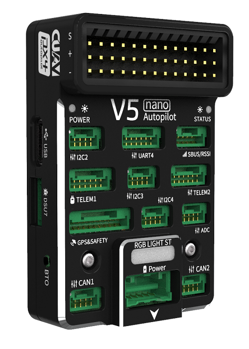

# CUAV V5 nano Autopilot

**V5 nano**<sup>&reg;</sup> is an autopilot for space-constrained applications, designed by CUAV<sup>&reg;</sup> in collaboration with the PX4 team.

The autopilot is small enough to use in 220mm racing drones, but remains powerful enough for most drone use.

> **Note** The V5 nano is similar to the [CUAV V5+](../flight_controller/cuav_v5_plus.md), but has an all-in-one form factor, fewer PWM ports (can't be used for [airframes](../airframes/airframe_reference.md) that use AUX ports), and does not have internal damping.




Some of its main features include:
- Full compatibility with the [Pixhawk project](https://pixhawk.org/) **FMUv5** design standard and uses the [Pixhawk Connector Standard](https://pixhawk.org/pixhawk-connector-standard/) for all external interfaces.
- More advanced processor, RAM and flash memory than FMU v3, along with more stable and reliable sensors.
- Firmware-compatible with PX4.
- Generous 2.6mm spacing for for I/O pins, making it easier to use all the interfaces. 


### Quick Summary

Main FMU Processor: STM32F765◦32 Bit Arm® Cortex®-M7, 216MHz, 2MB memory, 512KB RAM

* On-board sensors:
  * Accel/Gyro: ICM-20689
  * Accel/Gyro: ICM-20602
  * Accel/Gyro: BMI055
  * Magnetometer: IST8310
  * Barometer: MS5611

* Interfaces: 8 PWM outputs
  * 4 dedicated PWM/Capture inputs on FMU
  * Dedicated R/C input for CPPM
  * Dedicated R/C input for Spektrum / DSM and S.Bus
  * Analog / PWM RSSI input
  * 4 general purpose serial ports
  * 4 I2C ports
  * 4 SPI buses
  * 2 CANBuses 
  * Analog inputs for voltage / current of battery
  * 2 additional analog input

* Power System: Power Brick Input: 4.75~5.5V
* USB Power Input: 4.75~5.25V

* Weight and Dimensions:
  * Dimensions: 60\*40\*14mm
* Other Characteristics:
  * Operating temperature: -20 ~ 85°C （Measured value）


## Purchase

<!-- [CUAV Store](https://store.cuav.net/index.php?id_product=95&id_product_attribute=0&rewrite=cuav-new-pixhack-v5-autopilot-m8n-gps-for-fpv-rc-drone-quadcopter-helicopter-flight-simulator-free-shipping-whole-sale&controller=product&id_lang=1) -->

[CUAV Aliexpress](https://www.aliexpress.com/item/33050770314.html?storeId=3257035&spm=2114.12010612.8148356.9.dbe6790bjW2hpH) (international users)

[CUAV Taobao](https://item.taobao.com/item.htm?spm=a230r.1.14.8.26ab5258veQJRu&id=569404317857&ns=1&abbucket=13#detail) (China Mainland users)

> **Note** Autopilot may be purchased with included Neo GPS module


## Connections (Wiring) {#connection}

[V5 nano Wiring Quickstart](../assembly/quick_start_cuav_v5_nano.md)


## Pinouts {#pinouts}

Download **V5 nano** pinouts from [here](http://manual.cuav.net/V5-Plus.pdf).


## Building Firmware

> **Tip** Most users will not need to build this firmware!
  It is pre-built and automatically installed by *QGroundControl* when appropriate hardware is connected.

To [build PX4](https://dev.px4.io/en/setup/building_px4.html) for this target:
```
make px4_fmu-v5_default
```

## Voltage Ratings

*V5 nano* must be powered from the `Power` connector during flight, and may also/alternatively be powered from `USB` for bench testing.

> **Note** The `PM2` connector cannot not be used for powering the *V5 nano* (see [this issue](#issue_pm2)).

<span></span> 
> **Note** The Servo Power Rail is neither powered by, nor provides power to the FMU.
  However, the pins marked **+** are all common, and a BEC may be connected to any of the servo pin sets to power the servo power rail.


## Over Current Protection

The *V5 nano* has no over current protection.


## Peripherals {#Optional-hardware}

* [Digital Airspeed Sensor](https://item.taobao.com/item.htm?spm=a1z10.3-c-s.w4002-16371268452.37.6d9f48afsFgGZI&id=9512463037)
* [Telemetry Radio Modules](https://cuav.taobao.com/category-158480951.htm?spm=2013.1.w5002-16371268426.4.410b7a821qYbBq&search=y&catName=%CA%FD%B4%AB%B5%E7%CC%A8)
* [Rangefinders/Distance sensors](../sensor/rangefinders.md)

## Supported Platforms / Airframes

Any multicopter / airplane / rover or boat that can be controlled with normal RC servos or Futaba S-Bus servos.
The complete set of supported configurations can be seen in the [Airframes Reference](../airframes/airframe_reference.md).


## Known Issues

The issues below refer to the *batch number* in which they first appear. 
The batch number is the last two digits of the *serial number* that appears on a sticker on the side of the flight controller. 
For example, the serial number V031907XXXX**01** indicates the flight controller was in batch 01.


#### GPS not compatible with other devices (Critical) - Batch 01 {#issue_gps_compatible}

The *Neo v2.0 GPS* recommended for use with *CUAV V5+* and *CUAV V5 nano* is not fully compatible with other Pixhawk flight controllers (specifically, the buzzer part is not compatible and there may be issues with the safety switch).

The GPS will not work with other flight controllers, and is the only GPS unit that can be used with the *CUAV V5+* and *CUAV V5 nano*.
<!-- Nano/80/V5_NANO_RC01_2019_05_29 -->

- *Found:* Batch 01
- *Fixed:* -

#### PM2 cannot power the flight controller {#issue_pm2}

`PM2` can only measure battery voltage and current, but **not** power the flight controller.

> **Warning** We recommend you do not connect a power module to this connector when using PX4.

- *Found:* Batch 01
- *Fixed:* -

#### Volt regulation varies greater than +/- 5%

The 5 volt pins on all connectors will be lower when powered from USB than the Power Module (the pins will measure approximately 4.69V when only powered by USB, and 5.28 Volts when connected to the Power Module).

We recommend that when using USB with the *V5 nano* you *also connect the power module* (to avoid under-powering any connected peripherals).

> **Warning** Remove propellers *before* connecting the power module (this is important whenever bench testing with powered motors).

- *Found:* Batch 01
- *Fixed:* -


#### Using JTAG for hardware debugging {#issue_jtag}

`DSU7` FMU Debug Pin 1 is 5 volts - not the 3.3 volts of the CPU.

Some JTAG use this voltage to set the IO levels when communicating to the target.

For direct connection to *Segger Jlink* we recommended you use the 3.3 Volts of `DSM`/`SBUS`/`RSSI` pin 4 as Pin 1 on the debug connector (`Vtref`).

#### HV\_PM power module output is unfused {#issue_pm_unfused}

> **Warning** This is a serious safety issue.

The *HV\_PM* power module supplied with the kit is not protected by a fuse:
- Power **must** be turned off while connecting peripherals.
- Improper wiring can lead to *personal harm* or equipment damage!


## Further Information

* [V5 nano manual](http://manual.cuav.net/V5-nano.pdf)  (CUAV)
* [FMUv5 reference design pinout](https://docs.google.com/spreadsheets/d/1-n0__BYDedQrc_2NHqBenG1DNepAgnHpSGglke-QQwY/edit#gid=912976165)  (CUAV)
* [CUAV Github](https://github.com/cuav)  (CUAV)
* [Airframe build-log using CUAV v5 nano on a DJI FlameWheel450](../frames_multicopter/dji_f450_cuav_5nano.md)

