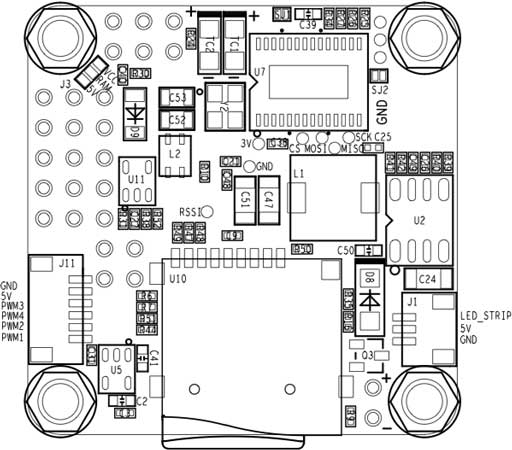
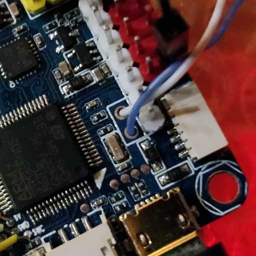

# Omnibus F4 SD

The *Omnibus F4 SD* is a controller board designed for racers. 
In contrast to a typical racer board it has some additional features, such as an SD card and a faster CPU.

These are the main differences compared to a [Pixracer](../flight_controller/pixracer.md):
- Lower price
- Fewer IO ports (though it's still possible to attach a GPS or a Flow sensor for example)
- Requires external pull up resistor on the I2C bus for external GPS, see [I2C](#i2c) below.
- Less RAM (192 KB vs. 256 KB) and FLASH (1 MB vs. 2 MB)
- Same board dimensions as a *Pixracer*, but slightly smaller form factor (because it has less connectors)
- Integrated OSD (not yet implemented in software)

> **Note** Note that an SD card is required for parameter storage.

<span></span>
> **Tip** All the usual PX4 features can still be used for your racer!


## Key Features

* Main System-on-Chip: [STM32F405RGT6](https://www.st.com/en/microcontrollers/stm32f405rg.html)
  * CPU: 168 MHz ARM Cortex M4 with single-precision FPU
  * RAM: 192 KB SRAM
  * FLASH: 1 MB
* Standard racer form factor: 36x36 mm with standard 30.5 mm hole pattern
* MPU6000 Accel / Gyro
* BMP280 Baro (not all boards have it mounted)
* microSD (logging and parameters)
* Futaba S.BUS and S.BUS2 / Spektrum DSM2 and DSMX / Graupner SUMD / PPM input / Yuneec ST24
* OneShot PWM out (configurable)
* built-in current sensor
* built-in OSD chip (AB7456 via SPI, not supported yet)


## Where to Buy

The board is produced by different vendors, with some variations (e.g. with or without a barometer).

> **Tip** PX4 is compatible with boards that support the Betaflight OMNIBUSF4SD target (if *OMNIBUSF4SD* is present on the product page the board should work with PX4).

<span></span>
> **Tip** Any Omnibus F4 labeled derivative (e.g. clone) should work as well. However, power distribution on these boards is of varying quality.

These are the boards tested and known to work:
- [Hobbywing XRotor Flight Controller F4](http://www.hobbywing.com/goods.php?id=590) 
   > **Note** This board fits on top of the [Hobbywing XRotor Micro 40A 4in1 ESC](http://www.hobbywing.com/goods.php?id=588) without soldering. This ESC board also provides power for the Omnibus board.
   
   Purchase from:
  * [Hobbywing XRotor F4 Flight Controller w/OSD](https://www.getfpv.com/hobbywing-xrotor-f4-flight-controller-w-osd.html) (getfpv)

- Original Airbot Omnibus F4 SD

  Purchase from:
  * [Airbot (CN manufacturer)](https://store.myairbot.com/omnibusf4prov3.html)
  * [Ready To Fly Quads (US reseller)](http://www.readytoflyquads.com/flip-32-f4-omnibus-v2-pro)


Accessories include:
* [ESP8266 WiFi Module](../telemetry/esp8266_wifi_module.md) for MAVLink telemetry.
  You need to connect these pins: GND, RX, TX, VCC and CH-PD (CH-PD to 3.3V). The baud rate is 921600.

  
## Connectors

Below are silkscreens for Omnibus F4 SD (V1), showing both top and bottom





## Pinouts

### Radio Control

RC is connected to one of the following ports:
- UART1
- SBUS/PPM port (via inverter, internally goes to UART1)

> **Note** Some Omnibus F4 boards have a jumper connecting either or both the MCU SBUS and PPM to a single pin header. Set your jumper or solder bridge to the appropriate MCU pin before use.


### UARTs

- UART6: GPS port
  - TX: MCU pin PC6
  - RX: MCU pin PC7

  - Airbot Omnibus F4 SD Pinout is on Port J10 (TX6/RX6):

  

- UART4
  - TX: MCU pin PA0
  - RX: MCU pin PA1
  - 57600 baud
  - It can be configured via [SYS_COMPANION](../advanced_config/parameter_reference.md#SYS_COMPANION) parameter.

  - Airbot Omnibus F4 SD Pinout:
    - TX: RSSI pin
    - RX: PWM out 5

  

  

### I2C

There is one I2C port available via:
- TX: MCU pin PB10
- RX: MCU pin PB11

> **Note** You will need external pullups on both signals (clock and data).
> You can use 2.2k pullups for example to attach an external mag.

  - Airbot Omnibus F4 SD Pinout is on Port J10 (SCL [clock] / SCA [data]):


Here is an example implementation. I used a Spektrum plug to get 3.3v from the DSM port, connecting only 3.3v + to each line via 2.2k resistor.


## Schematics

The schematics are provided by [Airbot](https://myairbot.com/): [OmnibusF4-Pro-Sch.pdf](http://bit.ly/obf4pro).

## Build & Upload Instructions

The board comes pre-installed with [Betaflight](https://github.com/betaflight/betaflight/wiki). 
Before PX4 firmware can be installed, the PX4 bootloader needs to be built and uploaded.

### Download

Download and build the [Bootloader](https://github.com/PX4/Bootloader) via:
```
git clone --recursive  https://github.com/PX4/Bootloader.git
cd Bootloader
make omnibusf4sd_bl
```

### Flash

You can flash the PX4 bootloader via the [dfu-util](http://dfu-util.sourceforge.net/) or the graphical [dfuse](https://www.st.com/en/development-tools/stsw-stm32080.html) tool on windows.

Don't be afraid to try flashing using any of the below methods. The STM32 MCU cannot be bricked. DFU cannot be overwritten by flashing and will always allow you to install a new firmware, even if flashing fails.

#### Enter DFU mode

Both methods require the board to be in DFU mode. To enter DFU mode, hold the boot button down while connecting the USB cable to your computer. The button can be released after the board is powered up.

#### dfu-util

```
dfu-util -a 0 --dfuse-address 0x08000000 -D  build/omnibusf4sd_bl/omnibusf4sd_bl.bin
```

Reboot the flight controller and it let it boot without holding the boot button.

#### dfuse

See the dfuse manual is here: https://www.st.com/resource/en/user_manual/cd00155676.pdf

Flash the `omnibusf4sd_bl.bin` file.

#### PX4 Firmware
Build and flash the PX4 Firmware with the following build target:

```
make omnibus-f4sd_default upload
```


### Installing other firmwares

If you later on want to switch back to *Betaflight*, you can easily do that:
- Backup the parameters by copying the **params** file on the SD card (or use another SD card)
- Keep the **bootloader** button pressed while attaching the USB cable
- Then flash *Betaflight* as usual with the *Betaflight-configurator*

## Configuration

> **Note** Make sure to insert an SD card as the parameters are stored there.

In addition to the [basic configuration](../config/README.md), the following parameters are important:

Parameter | Setting
--- | ---
[SYS_HAS_MAG](../advanced_config/parameter_reference.md#SYS_HAS_MAG) | This should be disabled since the board does not have an internal mag. You can enable it if you attach an external mag.
[SYS_HAS_BARO](../advanced_config/parameter_reference.md#SYS_HAS_BARO) | Disable this if your board does not have a barometer.
[MOT_ORDERING](../advanced_config/parameter_reference.md#MOT_ORDERING) | If you use a 4-in-1 ESC with Betaflight/Cleanflight motor assignment, this parameter can be set accordingly.

## Further Info

A review with further information of the board can be found [here](https://nathan.vertile.com/blog/2016/10/12/omnibusf4/).

[This page](https://blog.dronetrest.com/omnibus-f4-flight-controller-guide/) also provides a nice overview with pinouts and setup instructions.

