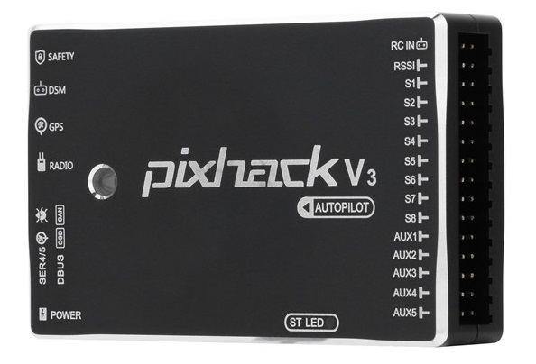

# Pixhack V3

The CUAV *Pixhack V3* flight controller board is a flexible autopilot intended primarily for manufacturers of commercial systems.

The board is a variant of the SOLO Pixhawk 2 (PH2) flight controller, which is in turn based on the [Pixhawk-project](https://pixhawk.org/) **FMUv3** open hardware design. It runs PX4 on the [NuttX](http://nuttx.org) OS, and is fully compatible with both PX4 or ArduPilot (APM) firmware.

*Pixhack V3* has significant improvements with respect to the original design, including better interface layout and the addition of vibration damping and a thermostat system

The controller is designed to be used with a domain-specific carrier board in order to reduce the wiring, improve reliability, and ease of assembly. For example, a carrier board for a commercial inspection vehicle might include connections for a companion computer, while a carrier board for a racer could includes ESCs form the frame of the vehicle.

## Quick Summary

* Microprocessor:
  * STM32F427
  * STM32F100 (Failsafe co-processor)
* Sensors:
  * Accelerometers (3): LS303D, MPU6000, MPU9250
  * Gyroscopes (3): L3GD20, MPU6000, MPU9250
  * Compass (2): LS303D, MPU9250
  * Barometer (2): MS5611 X2
* Interfaces:
  * MAVLink UART (2)
  * GPS UART (2)
  * DEBUG UART (1)
  * RC IN (for PPM, SBUS, DSM/DSM2)
  * RSSI IN: PWM OR 3.3ADC
  * I2C (2)
  * CAN BUS (1)
  * ADC IN: 3.3V X1 , 6.6V X1
  * PWM OUT: 8 PWM IO + 4 IO
* Power System:
  * PM POWER IN: 4.5 ~ 5.5 V |
  * USB POWER IN: 5.0 V +- 0.25v
* Weight and Dimensions:
  * Weight: 63g
  * Width: 68mm
  * Thickness: 17mm
  * Length: 44mm
* Other Characteristics:
  * Operating temperature: -20 ~ 60°c

## Availability

The board can be purchased from:
* [store.cuav.net](http://store.cuav.net/index.php?id_product=8&id_product_attribute=0&rewrite=pixhack-v3-autopilot&controller=product&id_lang=3)
* [leixun.aliexpress.com/store](https://leixun.aliexpress.com/store)

## Pinouts and Schematics

* Open hardware files: https://github.com/cuav/CUAV_Hardware/tree/master/Pixhack_V3
* Documentation/wiring guides: http://doc.cuav.net/PixHack/pixhack-v3.html
