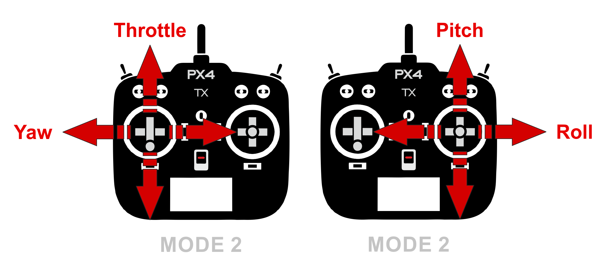
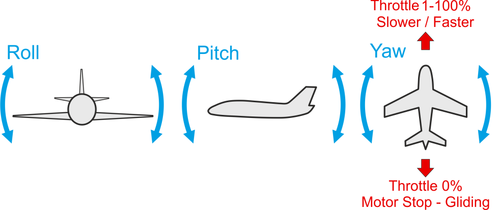

# Flying 101

This topic explains the basics of flying a vehicle using an [RC Transmitter](../getting_started/rc_transmitter_receiver.md) in a manual or autopilot-assisted flight mode \(for autonomous flight see: [Missions](../flying/missions.md)\).

> **Note** Before you fly for the first time you should read our [First Flight Guidelines](../flying/first_flight_guidelines.md).

## Flight Controls/Commands

All flying, including takeoff and landing, is controlled using the 4 basic commands: roll, yaw, pitch and throttle.

In order to control your aircraft you need to understand how the basic Roll, Pitch, Yaw and Throttle commands affect movement in 3D space. This differs depending on whether you're controlling a forward-flying aircraft like a plane, or a "hover aircraft" like a multicopter.

### Hover aircraft

Hover aircraft \(Copter, VTOL in hover mode\) respond to the movement commands as shown below:

* Pitch =&gt; Forward/Back.
* Roll =&gt; Left/right.
* Yaw =&gt; Left/right rotation around the centre of the frame.
* Throttle =&gt; Changed altitude/speed.

### Forward-flying aircraft

Forward-flying aircraft \(planes, VTOL in forward flight\) respond to the movement commands as shown below:

* Pitch =&gt; Up/down.
* Roll =&gt; Left/right and a turn.
* Yaw =&gt; Left/right tail rotation and turn.
* Throttle =&gt; Changed forward speed.

> **Note** The best turn for airplanes is called a coordinated turn,  
>   and is performed using roll and little yaw at the same time.  
>   This maneuver requires experience!

## Assisted Flight

Even with an understanding of how the vehicle is controlled, flight in fully manual mode can be quite unforgiving.  
New users should [configure their transmitter](../config/flight_mode_configuration.md) to use flight modes where  
the autopilot automatically compensates for erratic user input or environmental factors.

The following three modes are highly recommended for new users:

* Stabilized - Vehicle hard to flip, and will level-out if the sticks are released \(but not hold position\)
* Altitude - Climb and drop are controlled to have a maximum rate.
* Position - When sticks are released the vehicle will stop \(and hold position against wind drift\)

## Takeoff

> **Caution** Content required.

## Landing

> **Caution** Content required.

