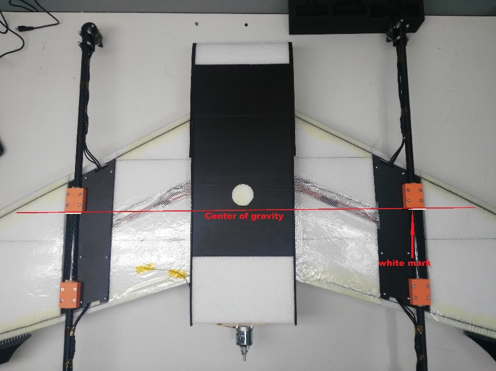
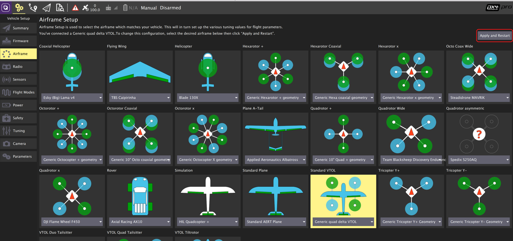

# Falcon Vertigo Hybrid VTOL RTF (Dropix)

The *Falcon Vertigo Hybrid VTOL* is a quadplane VTOL aircraft that has been designed to work with PX4 and the Dropix (Pixhawk compatible) flight controller. It can carry a small GoPro camera. 

The RTF kit contains everything needed for a full system except an RC receiver and telemetry module. The components can also be purchased separately.

Key information:

- **Frame:** [Falcon Vertigo Hybrid VTOL RTF](http://flyingwings.co.uk/new-products/venturi-fpv-wing-192.html)
- **Flight controller:** Dropix
- **Wing span:** 1.3m

## Bill of Materials

Almost everything you need is provided in the RTF kit (the links next to components below are provided in case you wished to purchase any component separately):

* Pre laminated EPP wings
* Wingtips and full hardware - [frame](http://flyingwings.co.uk/new-products/venturi-fpv-wing-193.html)
* [Dropix](https://drotek.com/shop/en/drotek-parts/494-dropix-flight-controller.html) flight controller with
  * [GPS Ublox M8N](https://drotek.com/shop/en/drotek-parts/512-ublox-neo-m8-gps-hmc5983-compass.html)
  * Power Sensor  
  * [Airspeed Sensor](https://drotek.com/shop/en/drotek-parts/793-digital-differential-airspeed-sensor-kit-.html)
* [Quad power set T-Motor](http://www.getfpv.com/motors/tiger-motor-mt-2216-11-900kv-v2.html)
* 4 x propeller 10”x 5” (quad motors)
* 4 x [ESC 25A](http://www.getfpv.com/tiger-motor-flame-25a-esc.html)
* 1 x propeller 10” x 5” (pusher motor)
* 1 x [ESC 30A](http://rctimer.com/product-146.html)
* [Pusher motor power system](http://airtekhobbies.com/c283410.html)
* Carbon fiber tubes and mounts
* G10 motor mounts
* 1 x [3700mah 4S 30C Lipo battery](https://www.overlander.co.uk/batteries/lipo-batteries/power-packs/3700mah-4s-14-8v-25c-lipo-battery-overlander-sport.html)
* [Power distribution board and cable](https://drotek.com/shop/en/home/453-power-module-for-apm-pixhawk-and-dropix.html)

The kit does not come with a radio receiver or (optional) telemetry modules. For this build we used the following components:

* [Receiver FR-SKY d4rII](http://www.getfpv.com/radios/receivers/frsky-d4r-ii-4ch-2-4ghz-accst-receiver-w-telemetry.html)
* [Telemetry 915 MHz modules](http://www.getfpv.com/flight-controllers/accessories-parts/holybro-100mw-fpv-transceiver-telemetry-radio-set-915mhz.html)

## Tools needed 

The following tools were used to assemble the airframe:

* Philips screwdriver
* 5.5 mm Hex Socket Screwdriver
* Wire cutters
* Soldering iron and solder
* Hobby stainless steel tweezer
* Gorilla glue
* Fiberglass reinforced tape

## Assembly steps 

The RTF kit requires the following assembly.

### Step 1: Attach motors mounts

1. Spread gorilla glue inside the wing brackets as shown.

   
   
1. Attach the carbon tube in the brackets. The bracket and tube must be aligned using the white mark (as shown in the picture).

   > **Note** This is very important because the white mark indicates the center of gravity.

   

1. The following images show the alignment of rods from other viewpoints:

   
   

### Step 2: Attach the wings
 
1. Insert both carbon tubes into the fuselage. 

   

1. Spread gorilla glue between the two white marks on each tube (indicated by the red arrows). The white mark in the center (blue arrow) will be placed in the center of the fuselage and the other marks on the sides.

   
 
1. Once the carbon tubes are inside the fuselage, spread gorilla glue on the rest of the tube and attach the wings.

1. The fuselage has two holes for the motor and servo cables. Pass the cables through the holes and then join the wings to the fuselage.

   
 
1. Within the fuselage connect the signal cables you just passed through from the wings to the ESC using the provided connectors. The ESC are already connected to the motors and set up to turn in the correct order (you will need to connect the ESC PDB to a power module in a later step).

   
 
1. As with the ESCs, the servos are already installed. Connect the signal cable from the wing (passed through the fuselage) to the flight controller.  

   
   
1. Repeat these steps for the other wing.

### Step 3: Connect the electronics 

This kit includes Dropix flight controller with most of the required electronics pre-connected (if you use another Pixhawk-compatible flight controller the connections are similar).

> **Note**  General information about connecting Dropix can be found in the [Dropix Wiring Quickstart](../assembly/quick_start_dropix.md).

#### Connect the ESC power connector and pass the signals cables to the flight controller

1. Connect the ESC to the power module using the XT60 connector

   
   
1. Pass the signals cables through to the flight controller
   
   

#### Motor Wiring 

The outputs of Dropix should be wired using the standard QuadPlane configuration (orientation as if "sitting in the plane").

Port | Connection
--- | ---
MAIN 1   | Front right motor, CCW
MAIN 2   | Back left motor, CCW
MAIN 3   | Front left motor, CW
MAIN 4   | Back right motor, CW
AUX  1   | Left aileron
AUX  2   | Right aileron 
AUX  3   | Elevator
AUX  4   | Rudder
AUX  5   | Throttle

#### Flight Controller Connections: Motors, Servos, RC receiver, current sensor

The image below shows back of the dropix flight controller, highlighting the outputs pins to connect quad motors cables, aileron signal cables, throttle motor, and the current sensor and receiver (RC IN) input pins.

1. Connect quad motors signal cables.

1. Connect the aileron cables and throttle motor in the auxiliary outputs.

1. Connect the throttle motor signal cable from the ESC to the appropriate flight controller auxiliary port. Connect the ESC to the throttle motor.

   

1. Connect the receiver (RC IN). 

#### Flight Controller Connections: Telemetry, Airspeed Sensor, GPS, Buzzer and Safety Switch

The sensor inputs, telemetry, buzzer and safety switch are located in the front of the flight controller, as shown in the connection diagram below.

1. Connect the telemetry, airspeed sensor, GPS, buzzer and safety switch as shown.

   

#### Flight Controller: Connect power module and external USB 

The inputs for the USB port, power module and external USB are located on the right side of the flight controller. 

1. Connect power and USB as shown

   

> **Tip** The external USB is optional. It should be used if access to the USB port is difficult once the flight controller is mounted.

#### Install the pitot tube (airspeed sensor)

The pitot tube is installed on the front of the plane and connected to the airspeed sensor via a tube. 

> **Caution** It is important that nothing obstructs airflow to the Pitot tube. This is critical for fixed-wing flight and for transitioning from quad to plane.

1. Install the Pitot tube in the front of the plane

   

1. Secure the connecting tubing and ensure that it is not bent/kinked.
   
   
   
1. Connect the tubes to the airspeed sensor. 

   

#### Install/connect receiver and telemetry module
 
1. Paste the receiver and telemetry module to the outside of the vehicle frame.
   
   
   
1. Connect the receiver to the RC IN port on the *back* of the dropix, as shown above (also see the [flight controller instructions](#dropix_back)).
 
1. Connect the telemetry module to the *front* of the flight controller as shown below (see the [flight controller instructions](#dropix_front) for more detail on the pins).
   
   

#### GPS/Compass module   

The GPS/Compass module is already mounted on the wing, in the default orientation. You don't need to have to do anything extra for this!

   

#### Mount and orient the flight controller

1. Set your flight controller orientation to 270 degrees.
   
   
   
1. Secure the controller in place using vibration damping foam. 
 

### Step 4: Final Assembly Checks

The final assembly step is to check the vehicle is stable and that the motors have been set up correctly.

1. Check that the motors turn in the correct directions (as in the QuadX diagram below).

   

   > **Tip** If necessary the servo direction can be reversed using the `PWM_REV` parameters in the `PWM_OUTPUT` group of QGroundControl (cogwheel
     tab, last item in the left menu)
 
1. Check the vehicle is balanced around the expected centre of gravity

   * Hold the vehicle with your fingers at the center of gravity and check that the vehicle remains stable. 

      
   
   * If the vehicle leans forward or backwards, move the motors to balance it.
   
      

## Configuration

Perform the normal [Basic Configuration](../config/README.md).

Notes:

1. For [Airframe](../config/airframe.md) select the vehicle group/type as *Standard VTOL* and the specific vehicle as *Generic quad delta VTOL* as shown below.
   
   
 
1. Set the [Autopilot Orientation](../config/flight_controller_orientation.md) to `ROTATION_YAW_270` as the autopilot is mounted [sideways](#flight_controller_orientation) with respect to the front of the vehicle. The compass is oriented forward, so you can leave that at the default (`ROTATION_NONE`).
1. The default parameters are sufficient for stable flight. For more detailed tuning information see [Standard VTOL Wiring and Configuration](../config/vtol_quad_configuration.md).

After you finish calibration the VTOL is ready to fly. 

## Video


http://www.youtube.com/watch?v=h7OHTigtU0s


## Support

If you have any questions regarding your VTOL conversion or configuration please visit <http://discuss.px4.io/c/vtol>.

