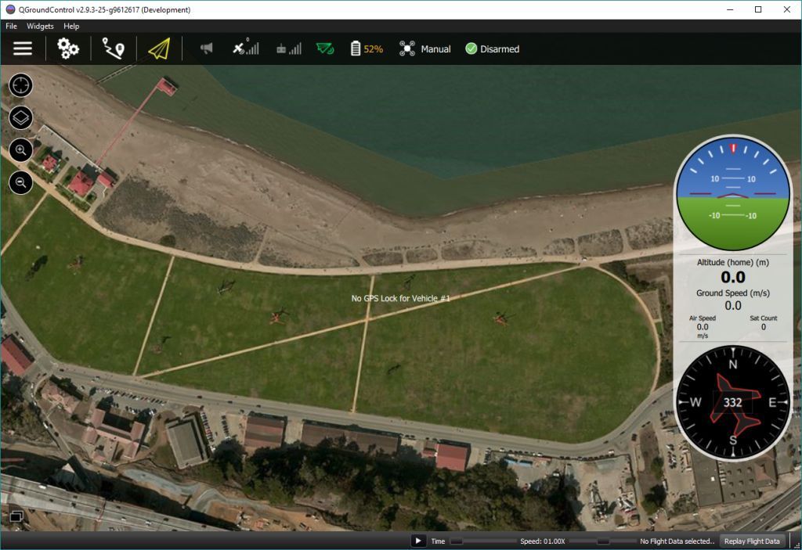
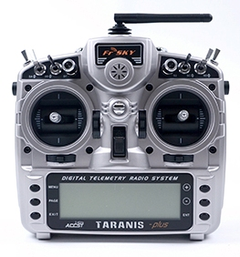

# PX4 Basic Concepts

In this chapter we will introduce you to the most basic concepts of setting up and controlling your drone. This section is meant mostly for novice users but it is a good quick start introduction to PX4 autopilot concepts for the experienced users as well.

## PX4 Autopilot

PX4 is platform independent autopilot software (or a software stack/firmware) that can fly or drive Unmanned Aerial or Ground Vehicles (UAV/UGV). It is loaded (flashed) on certain [vehicle control hardware](flight_controller_selection.md) and together with Ground Control Station it makes a fully autonomous autopilot system. 

The PX4 ground control station is called  [QGroundControl](http://qgroundcontrol.com/) and is integral part of the PX4 Autopilot System. QGroundControl can run on Windows, OS X or Linux. Download and install QGroundControl from [here](http://qgroundcontrol.com/downloads/). With the help of  QGroundControl you can load (flash) the PX4 on to the [vehicle control hardware](flight_controller_selection.md), you can setup the vehicle, change different parameters, get real-time flight information and create and execute fully autonomous missions.

If you are already familiar with the basic concepts, you can move on to [Basic Assembly](https://docs.px4.io/en/assembly/) section that explains how to wire your specific autopilot hardware. To load firmware and set up the vehicle with QGroundControl, visit the section [Basic Configuration](https://docs.px4.io/en/config/).

## Heading and Directions

All the vehicles, boats and aircraft have a heading direction or an orientation based on their forward motion.

It is important to know the vehicle heading direction in order to align the autopilot with the vehicle vector of movement. Despite it is not obvious, Multicopters have a heading despite they are symmetrical from all sides. Usually manufacturers use a colored props or colored arms to indicate the heading.

In our illustrations we will use red coloring for the front propellers of multicopter to show heading.

You can read in depth about heading in [Flight Controller Orientation](../config/flight_controller_orientation.md)

## PX4 Connections

In order to set up, control and interact with your PX4 drone you need to connect with it. The main connection types are listed below.

### Remote Control

A [Remote Control \(RC\)](../getting_started/rc_transmitter_receiver.md) radio system is used to *manually* control the vehicle. It consists of a remote control unit that uses a transmitter to communicate stick/control positions with a receiver based on the vehicle. Some RC systems can additionally receive telemetry information back from the autopilot.

> **Note** PX4 does not require a remote control system for autonomous flight modes.

[RC System Selection](../getting_started/rc_transmitter_receiver.md) explains how to choose an RC system. Other related topics include:
* [Radio/Remote Control Setup](../config/radio.md) - Remote control configuration in *QGroundControl*.
* [Flying 101](../flying/basic_flying.md) - Learn how to fly with a remote control.
* [FrSky Telemetry](../peripherals/frsky_telemetry.md) - Set up the RC transmitter to receive telemetry/status updates from PX4.

### Data/Telemetry Radios

[Data/Telemetry Radios](../telemetry/README.md) can provide a wireless MAVLink connection between a ground control station like *QGroundControl* and a vehicle running PX4. This makes it possible to tune parameters while a vehicle is in flight, inspect telemetry in real-time, change a mission on the fly, etc.

### Offboard/Companion Computer

PX4 can be controlled from a separate on-vehicle companion computer via a serial cable or wifi. The companion computer will usually communicate using a MAVLink Robotics API like DroneCore or MAVROS.

> **Note** Using a Robotics API requires software development skills, and is outside the scope of this guide.

* [Off-board Mode](../flight_modes/offboard.md) - Flight mode for offboard control of PX4 from a GCS or companion computer. 
* [Robotics APIs](https://dev.px4.io/en/robotics/) (PX4 Developer Guide)

## Flight Modes

Flight modes provide different types/levels of vehicle automation and autopilot assistance to the user (pilot). 
*Autonomous modes* are fully controlled by the autopilot, and require no pilot/remote control input. 
These are used, for example, to automate common tasks like takeoff, returning to the home position, and landing. 
Other autonomous modes execute pre-programmed missions, follow a GPS beacon, or accept commands from an offboard computer or ground station. 

*Manual modes* are controlled by the user (via the RC control sticks/joystick) with assistance from the autopilot. 
Different manual modes enable different flight characteristics - for example, some modes enable acrobatic tricks, 
while others are impossible to flip and will hold position/course against wind.

> **Tip** Not all flight modes are available on all vehicle types, and some modes can only be used when specific conditions have been met (e.g. many modes require a global position estimate).

An overview of the available flight modes [can be found here](../getting_started/flight_modes.md). 
Instructions for how to set up your remote control switches to turn on different flight modes is provided in [Flight Mode Configuration](../config/flight_mode.md).

## Safety Settings (Failsafe)

PX4 has configurable failsafe systems to protect and recover your vehicle if something goes wrong! These allow you to specify areas and conditions under which you can safely fly, and the action that will be performed if a failsafe is triggered (for example, landing, holding position, or returning to a specified point).

> **Note** You can only specify the action for the *first* failsafe event. Once a failsafe occurs the system will enter special handling code, such that subsequent failsafe triggers are managed by separate system level and vehicle specific code.

The main failsafe areas are listed below:
- Low Battery
- Remote Control (RC) Loss
- Position Loss (global position estimate quality is too low).
- Offboard Loss (e.g. lose connection to companion computer)
- Data Link Loss (e.g. lose telemetry connection to GCS).
- Geofence Breach (restrict vehicle to flight within a virtual cylinder).
- Mission Failsafe (prevent a previous mission being run at a new takeoff location).
- Traffic avoidance (triggered by transponder data from e.g. ADSB transponders).

For more information see: [Safety](../config/safety.md) (Basic Configuration).

