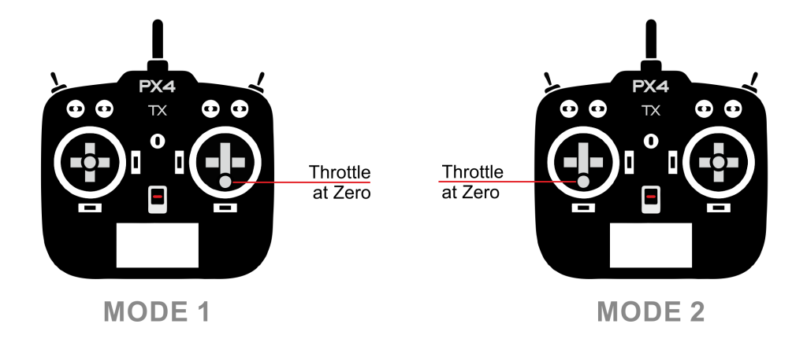

# Remote Control Systems

A remote control (RC) radio system is required if you want to *manually* control your vehicle. This topic explains a little about how RC works, and how to choose an appropriate radio system for your vehicle. 

> **Tip** PX4 does not require a remote control system for autonomous flight modes.

## How do RC Systems Work?

An RC system has a ground-based *remote control unit* that is used by the operator to control the vehicle. The remote control typically contains a radio transmitter that is bound to, and communicates with, a (compatible) receiver on the vehicle. The receiver is connected to the flight controller, which in turn drives the vehicle motors and actuators.

<!-- image showing the different parts here would be nice -->

> **Note** Some RC systems also allow the remote control unit to receive and display vehicle telemetry (e.g. battery level, flight mode, etc.). This requires radio modules that can both transmit and receive, and a configurable remote control unit.

The transmitter encodes a number of separate discrete *channels* within the radio signal, each which can be used to send the value of a single switch, dial, control stick position in one axis, etc.

Transmitters/receivers support different numbers of channels, depending on the model. At least 2 channels are required for controlling ground vehicle movement (steering + throttle), and at least 4 for aircraft (roll, pitch, yaw, thrust). An 8 or 16 channel transmitter provides additional channels that you can use to control other mechanisms or activate different [flight mode](../flight_modes/README.md)/functionality provided by the autopilot. 

## Remote Control Units for Aircraft {#transmitter_modes}

The most popular *form* of remote control unit for UAVs is shown below. It has separate control sticks for controlling roll/pitch and for throttle/yaw as shown (i.e. aircraft need at least 4 channels). 

There are numerous possible layouts for the control sticks, switches, etc. The more common layouts have been given specific "Mode" numbers. *Mode 1* and *Mode 2* (shown below) differ only in the placement of the throttle. 

> **Note** The choice of mode is largely one of taste, and must be made before you buy the remote control.
  

## Remote Control Units for Ground Vehicles

An Unmanned Ground Vehicle (UGV)/car minimally requires a 2 channel transmitter in order to send the values for steering and speed. Commonly transmitters set these values using a wheel and trigger, two single-axis control sticks, or a single dual-axis control stick.

There is nothing to stop you using more channels/control mechanisms, and these can be very useful for engaging additional actuators and autopilot modes.

## Choosing RC System Components

You will need to select a remote control unit, transmitter and receiver that are compatible with each other. In addition, receivers have to be be compatible with PX4 and the flight controller hardware (below we list some of the receivers that have been validated for use with Flight Controller boards and PX4).

> **Note** Before you can use the radio system you will need to *bind* them so that they communicate. Follow the binding instructions that come with your specific transmitter/receiver!

Compatible radio systems are often sold together. For example, [FrSky Taranis X9D and FrSky X8R](https://hobbyking.com/en_us/frsky-2-4ghz-accst-taranis-x9d-plus-and-x8r-combo-digital-telemetry-radio-system-mode-2.html?___store=en_us) are a popular combination.

### Remote Control Units

One of the most popular radio control units is the *FrSky Taranis X9D*. It offers high flexibility thanks to the highly customizable open source OpenTX Firmware and a custom radio transmitter module slot. It can directly be used with the internal transmitter module when binding for example to the recommended *FrSky X4R-SB* (S-BUS, low delay) or *X4R* (PPM-Sum, legacy) receivers.

> **Note** The remote control unit can display vehicle telemetry when used with [FrSky](../peripherals/frsky_telemetry.md) radio modules. 

Turnigy remote control units are also popular, and can be used with FrSky radio modules.

### Transmitters

* *FrSky Taranis X9D Remote Control* internal transmitter module (recommended for use with receivers: *FrSky X4R-SB* (S-BUS, low delay) or *X4R* (PPM-Sum, legacy)).
* Turnigy remote e.g. with the FrSky transmitter/receiver modules.
* Futaba Transmitters and compatible Futaba S-Bus receivers.
* Long range ~900MHz, low latency: "Team Black Sheep Crossfire" or "Crossfire Micro" set with a compatible remote (e.g. Taranis)
* Long Range ~433MHz: ImmersionRC EzUHF set with a compatible remote (e.g. Taranis)

### Receivers

Different receivers connect to the flight controller using different protocols/connectors. 

Pixhawk supports many different radio receiver models. *PX4* and *Pixhawk* have been validated with:

- All Spektrum DSM RC receivers
- All Futaba S.BUS and S.BUS2 RC receivers
- All FrSky PPM and S.Bus models
- Graupner HoTT
- All PPM models from other manufacturers

The appropriate connection for each type of receiver is described below:

- PPM and S.BUS receivers must connect to the **RC** ground, power and signal pins as shown.
  
- PWM receivers must connect to the RCIN channel *via* a PPM encoder 
  [like this one](http://www.getfpv.com/radios/radio-accessories/holybro-ppm-encoder-module.html) (PPM receivers use a single signal wire for all channels, while PWM receivers have an individual wire for each channe).
- Spektrum and DSM receivers must connect to the **SPKT/DSM** input.
  

## Related Topics

* [RC System Selection](../getting_started/rc_transmitter_receiver.md) - Choose a compatible RC system.
* [Radio/Remote Control Setup](../config/radio.md) - Configuring your radio with PX4.
* [Flying 101](../flying/basic_flying.md) - Learn how to fly with a remote control. 