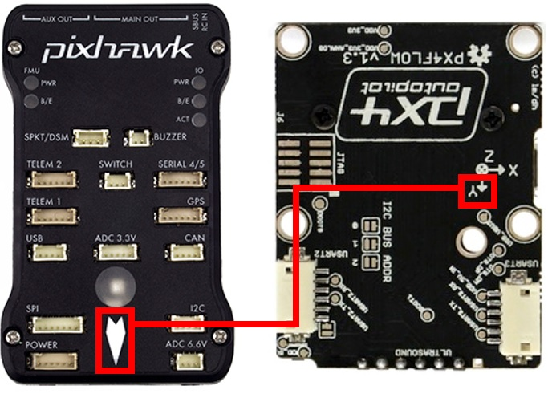

# Bitcraze Optical Flow Board


https://youtu.be/0Jpq6DU_HVg


## Where to Buy

You can order this module from the [Bitcraze website](https://www.bitcraze.io/flow-breakout/).

## Specifications

## Pixhawk Setup

In order to connect the bitcraze flow board to the Pixhawk you will need to solder the wires of the Pixhawk SPI
cable to the flow board. The SPI cable has 7 wires from which you need to connect 6 to the flow board. The diagram below shows you which wires you need to solder to which location on the flow board.

| Pixhawk SPI port (from left to right) | Bitcraze flow board |
| -- | -- |
| 1 (VCC)  | VCC |
| 2 (SCK)  | CLK |
| 3 (MISO) | MISO |
| 4 (MOSI) | MOSI |
| 5 (CS1) | Do not connect |
| 6 (CS2) | CS |
| 7 (GND) | GND |

> **Note** Applies to all PX4 FMU versions, including all versions of Pixhawk.

- Update the firmware on PX4Flow using *QGroundControl* (in the top left menu, click on CONFIG, then on Firmware Upgrade)
- Connect PX4Flow I2C to the Pixhawk I2C

The module will be detected on boot.
Flow data should be coming through at 10Hz if the autopilot is connected via **USB**. 
Flow data is transmitted via wireless at a lower rate.

### Mounting/Orientation

The recommended mounting orientation (meaning: zero rotation) is defined as Y on flow board pointing towards **front of vehicle**, as shown in the following picture.

On **PX4**, the orientation should be set using the parameter [SENS_FLOW_ROT](../advanced_config/parameter_reference.md#SENS_FLOW_ROT). 
The above orientation maps to `SENS_FLOW_ROT`=270 degrees (the default). 

Make sure the the PX4Flow board is well dampened.

> **Warning** PX4Flow emits a significant amount of electromagnetic radiation, and should be placed as far away from other electronics (in particular GPS modules) as possible.
  (see [Hardware/issues/8](https://github.com/PX4/Hardware/issues/8) for more information).

### Connecting

The PX4flow is connected to the I2C bus. 
If you are connecting multiple devices to the same bus you will need to set each with a unique address. 
The next section explains how.