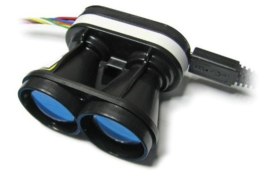
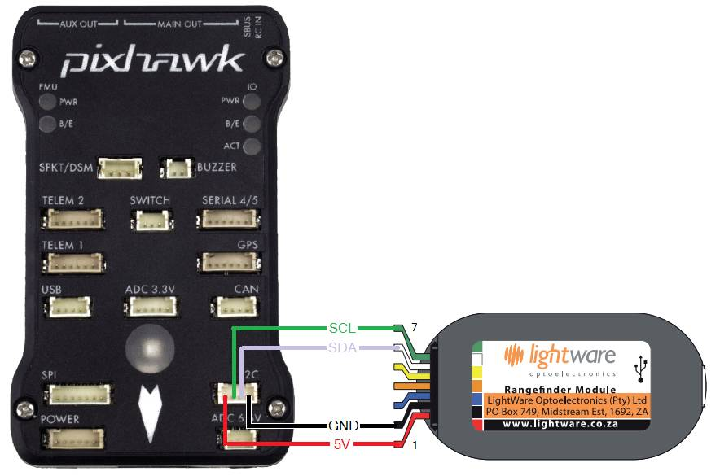

# LightWare SF1XX Lidar

LightWare develops a range of light-weight, general purpose, laser altimeters ("Lidar") suitable for mounting on UAVs. These are useful for applications including terrain following, precision hovering (e.g. for photography), warning of regulatory height limits, anti-collision sensing etc.

PX4 supports the following LightWare Lidar rangefinders through the I2C bus (only):
* [SF10/A](http://lightware.co.za/shop2017/drone-altimeters/26-sf10a-25-m.html) (25 m)
* [SF10/B](http://lightware.co.za/shop2017/drone-altimeters/25-sf10b-50-m.html) (50 m)
* SF10/C (100m) (Discontinued)
* [SF11/C](http://lightware.co.za/shop2017/drone-altimeters/44-sf11c-120-m.html) (120 m)
* [LW20](http://lightware.co.za/shop2017/drone-altimeters/51-lw20-100-m.html) (100 m) - Waterproofed (IP67) with servo for sense-and-avoid applications

## Configuring Lidar

Newer sensors/versions require no additional configuration.

> **Tip** Older sensors may be miss-configured to have an I2C address equal to `0x55` (this conflicts with `rgbled` module).
> You can check the address by connecting the sensor via USB (it has an internal USB to serial converter), run terminal, press **space**.
> If the I2C address is equal to `0x66` the sensor can be used with PX4.

## Hardware Setup

Connect the Lidar the autopilot I2C port as shown below (in this case, for the [Pixhawk 1](../flight_controller/mro_pixhawk.md)).

> **Note** The PX4 driver for this rangefinder only supports I2C connections. You cannot use a UART etc.

## Configuring PX4

The only configuration required is to set the type of the rangefinder. You can do this in *QGroundControl* [Settings > Parameters](https://docs.qgroundcontrol.com/en/SetupView/Parameters.html).

Set the [SENS_EN_SF1XX](../advanced_config/parameter_reference.md#SENS_EN_SF1XX) parameter to match the Lidar model and then reboot:
* `0` lidar disabled
* `1` SF10/a
* `2` SF10/b
* `3` SF10/c
* `4` SF11/c
* `5` SF/LW20
