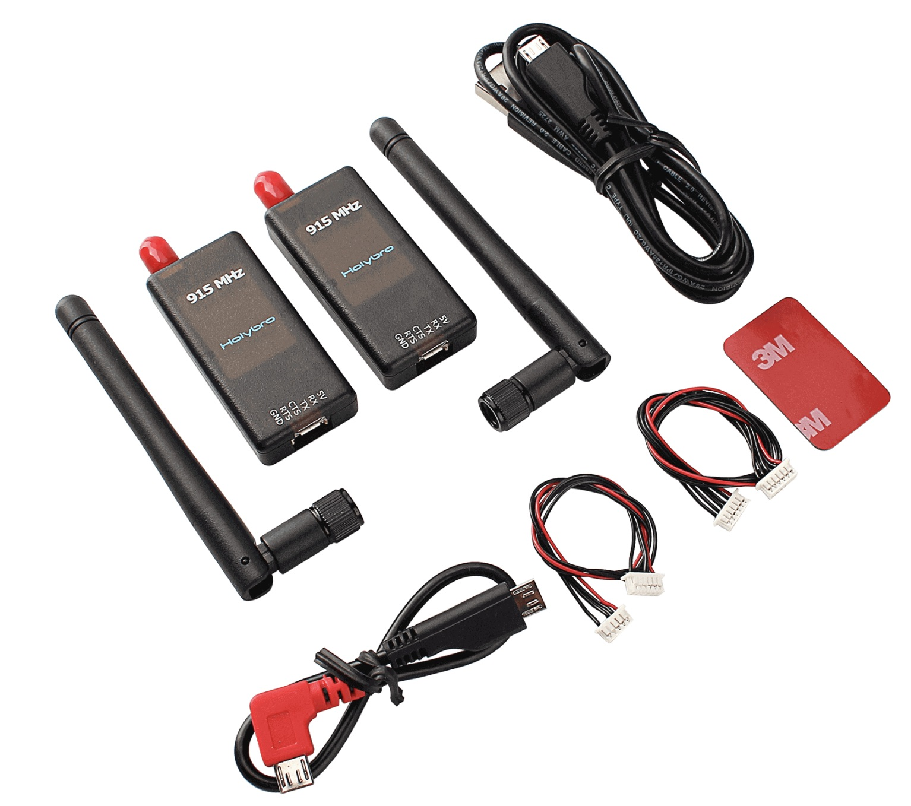

# SiK Radio

[SiK radio](https://github.com/LorenzMeier/SiK) is a collection of firmware and tools for telemetry radios.

Hardware for the SiK radio can be obtained from various manufacturers/stores in variants that support different range and form factors. Typically you will need a pair of devices - one for the vehicle and one for the ground station. 

## Purchase {#vendors}

* 3DR Radio \(small\) - [US (915MHz)](https://store.3dr.com/products/915-mhz-telemetry-radio) / [European (433MHz)](https://store.3dr.com/products/433-mhz-telemetry-radio)
* [HK Radio](http://www.hobbyking.com/hobbyking/store/uh_viewitem.asp?idproduct=55559) \(small\)
* [RFD900u](http://rfdesign.com.au/products/rfd900u-modem/) \(small\)
* [RFD900](http://rfdesign.com.au/products/rfd900-modem/) \(long range\)

## Setup/Configuration

The ground station-based radio is connected via USB (essentially plug-n-play). 

The vehicle is connected to the flight-controller's `TELEM1` port, and typically requires no further configuration.

## Firmware Update

Hardware sourced from most [vendors](#vendors) should come pre-configured with the latest firmware. You may need to update older hardware with new firmware, for example to gain support for MAVLink 2.

You can update the radio firmware using *QGroundControl*: [QGroundControl User Guide > Loading Firmware](https://docs.qgroundcontrol.com/en/SetupView/Firmware.html).

## Advanced Setup/Configuration

The PX4 Developer Guide has [additional information](https://dev.px4.io/en/data_links/sik_radio.html) about building firmware and AT-command based configuration. This should not be required by non-developers.